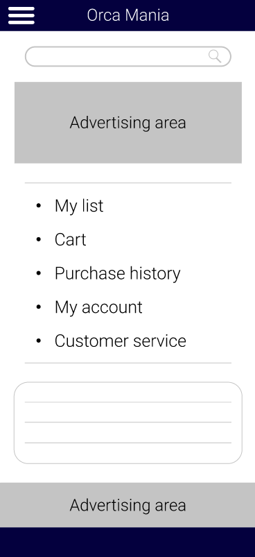
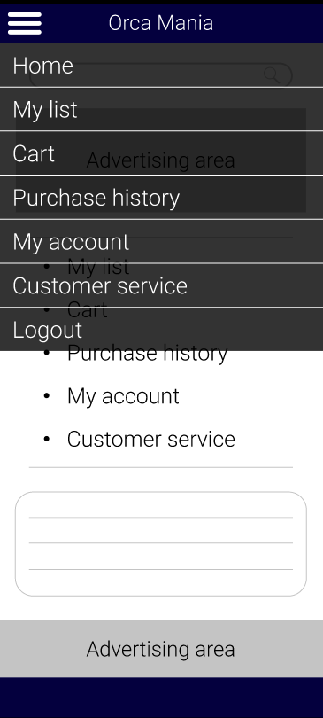
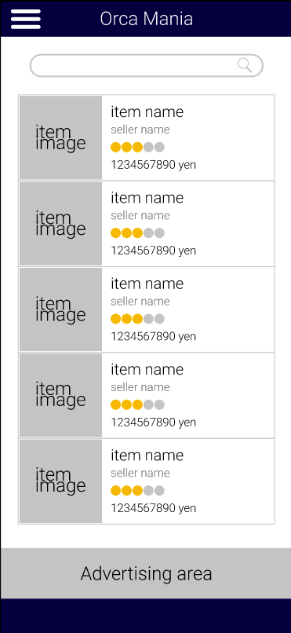
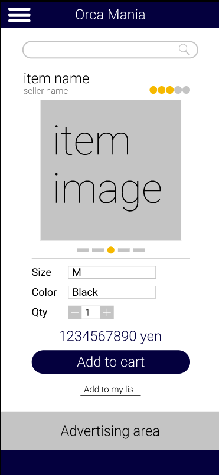
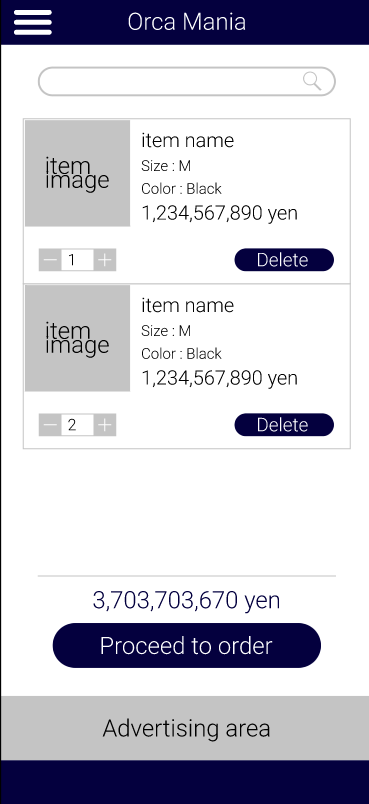
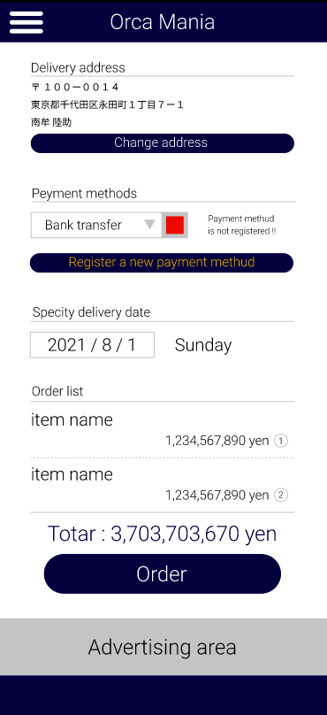
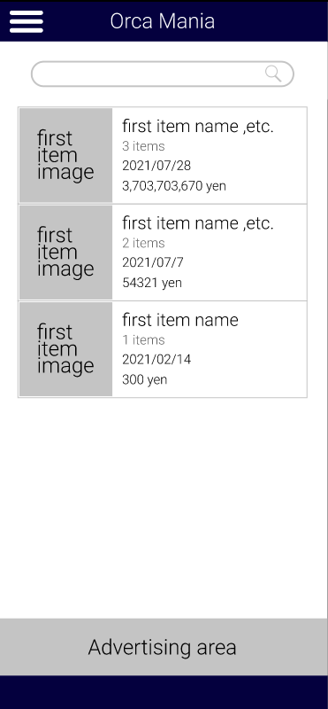
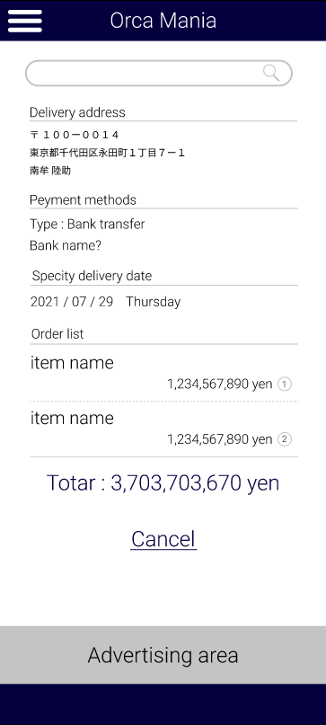
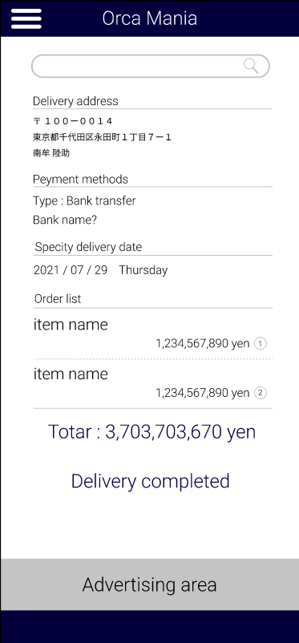

### 画面詳細図
### プロトタイプは以下のリンク先
[プロトタイプ](https://www.figma.com/file/iLXGkOvQQgkSVKFXDXTANB/%E3%82%B5%E3%83%B3%E3%83%97%E3%83%ABEC%E3%82%B5%E3%82%A4%E3%83%88?node-id=48%3A2)

| ID | ページ名 | 備考 |
| :---: | :--- | :--- |
|1|メインページ||
|2|ハンバーガーメニュー|全ページ共通|
|3|商品一覧ページ||
|4|マイリストページ||
|5|商品詳細ページ||
|6|カートページ||
|7|注文ページ||
|8|注文履歴一覧ページ||
|9|注文履歴詳細ページ|未発送|
|10|注文履歴詳細ページ|発送済|
|11|ログインページ||
|12|新規登録ページ||
|13|登録完了ページ||
|14|マイアカウント情報ページ||

*****

## メインページ

| ID | 要素 | 内容　|　アクション　|　イベント　|　対応DB　|
| :---: | :--- | :--- | :---: | :--- | :--- |
|1|ヘッダー|サイト名表示,アイコン表示| | | |
|2|ハンバーガーメニュー|メニュー表示|クリック|ドロップダウン表示| |
|3|検索窓|テキスト入力|クリック| | 〇 |
|4|虫眼鏡|アイコン表示|クリック|商品一覧へ遷移||
|5|My list|テキスト表示|クリック|マイリストページへ遷移| |
|6|Cart|テキスト表示|クリック|カートページへ遷移| |
|7|Purchase history|テキスト表示|クリック|購入履歴一覧ページへ遷移| |
|8|My account|テキスト表示|クリック|マイアカウント情報ページ遷移| |
|9|Costomer servis|テキスト表示|クリック|未定(おそらくページ)||
|10|お知らせエリア|テキスト表示|スクロール|||
|11|広告エリア1|広告表示|クリック|広告の提供元ページへ遷移||
|12|広告エリア2|広告表示|クリック|広告の提供元ページへ遷移||

*****

## ハンバーガーメニュー

*****

| ID | 要素 | 内容 | アクション | イベント | 対応DB |
| :---: | :--- | :--- | :---: | :--- | :--- |
|1|ハンバーガーメニュー|メニュー表示|クリック|ドロップダウン表示| |
|2|Home|テキスト表示|クリック|メインページへ遷移||
|3|My list|テキスト表示|クリック|マイリストページへ遷移||
|4|Cart|テキスト表示|クリック|カートページへ遷移||
|5|Purchase history|テキスト表示|クリック|購入履歴一覧ページへ遷移||
|6|My account|テキスト表示|クリック|アカウント情報ページへ遷移||
|7|Costomer servis|テキスト表示|クリック|未定||
|8|Logout|テキスト表示|クリック|メインページへ遷移||

*****

## 商品一覧ページ/マイリストページ

| ID | 要素 | 内容　|　アクション　|　イベント　|　対応DB　|
| :---: | :--- | :--- | :---: | :--- | :--- |
|1|ヘッダー|サイト名表示,アイコン表示| | | |
|2|ハンバーガーメニュー|メニュー表示|クリック|ドロップダウン表示| |
|3|検索窓|テキスト入力|クリック| | 〇 |
|4|虫眼鏡|アイコン表示|クリック|商品一覧へ遷移|-|
|5|item image|画像表示|||〇|
|6|item name|テキスト表示|||〇|
|7|sellser name|テキスト表示|||〇|
|8|5段階評価|アイコン表示|||〇|
|9|item price|テキスト表示|||〇|
|10|商品情報|ID 5 - ID 9|クリック|商品詳細ページに遷移|〇|
|11|広告エリア|広告表示|クリック|広告の提供元ページへ遷移||

*****

## 商品詳細ページ

| ID | 要素 | 内容　|　アクション　|　イベント　|　対応DB　|
| :---: | :--- | :--- | :---: | :--- | :--- |
|1|ヘッダー|サイト名表示,アイコン表示| | | |
|2|ハンバーガーメニュー|メニュー表示|クリック|ドロップダウン表示| |
|3|検索窓|テキスト入力|クリック| | 〇 |
|4|虫眼鏡|アイコン表示|クリック|商品一覧へ遷移|-|
|5|item name|テキスト表示|||〇|
|6|sellser name|テキスト表示|クリック|商品一覧ページ|〇|
|7|5段階評価|アイコン表示|||〇|
|8|item image|画像表示|スワイプ|スライド|〇|
|9|ポインタ|アイコン表示||表示変化||
|10|オプション1|テキスト表示|||〇|
|11|オプション選択1|テキスト選択|クリック||〇|
|12|オプション2|テキスト表示|||〇|
|13|オプション選択2|テキスト選択|クリック||〇|
|14|Qty|テキスト表示||||
|15|個数入力|数値入力|クリック||〇|
|16|マイナスボタン|アイコンボタン|クリック|||
|17|プラスボタン|アイコンボタン|クリック|||
|18|item price|テキスト表示|||〇|
|19|カート追加ボタン|アイコンボタン|クリック|カートページへ遷移|〇|
|20|マイリスト追加|テキスト表示|クリック|マイリストページへ遷移|〇|
|21|広告エリア|広告表示|クリック|広告の提供元ページへ遷移||

*****

## カートページ

| ID | 要素 | 内容　|　アクション　|　イベント　|　対応DB　|
| :---: | :--- | :--- | :---: | :--- | :--- |
|1|ヘッダー|サイト名表示,アイコン表示| | | |
|2|ハンバーガーメニュー|メニュー表示|クリック|ドロップダウン表示| |
|3|検索窓|テキスト入力|クリック| | 〇 |
|4|虫眼鏡|アイコン表示|クリック|商品一覧へ遷移|-|
|5|item image|画像表示|||〇|
|6|item name|テキスト表示|||〇|
|7|sellser name|テキスト表示|||〇|
|8|5段階評価|アイコン表示|||〇|
|9|item price|テキスト表示|||〇|
|10|個数入力|数値入力|クリック||〇|
|11|マイナスボタン|アイコンボタン|クリック|||
|12|プラスボタン|アイコンボタン|クリック|||
|13|消去ボタン|アイコンボタン||再読み込み|〇|
|14|商品情報|ID 5 - ID 13|クリック|商品詳細ページに遷移|〇|
|15|total price|テキスト表示||||
|16|注文へ進むボタン|アイコンボタン|クリック|注文ページへ遷移|〇|
|17|広告エリア|広告表示|クリック|広告の提供元ページへ遷移||

*****

## 注文ページ

| ID | 要素 | 内容　|　アクション　|　イベント　|　対応DB　|
| :---: | :--- | :--- | :---: | :--- | :--- |
|1|ヘッダー|サイト名表示,アイコン表示| | | |
|2|ハンバーガーメニュー|メニュー表示|クリック|ドロップダウン表示| |
|3|Delivery address|テキスト表示|||
|4|郵便番号|テキスト表示||〇|
|5|住所|テキスト表示||〇|
|6|名前|テキスト表示||〇|
|7|配送先変更ボタン|アイコンボタン|クリック|アカウント情報ページへ遷移|〇|
|8|Peyment methods|テキスト表示||||
|9|支払い方法選択|テキスト選択|クリック|||
|10|チェックランプ|アイコン||表示変化||
|11|警告メッセージ|テキスト表示||id 10が赤の場合表示||
|12|支払方法登録ボタン|アイコンボタン|クリック|未定||
|13|Specity delivery date|テキスト表示||||
|14|日時指定|日付選択|クリック|||
|15|曜日表示|テキスト表示||||
|16|Order list|テキスト表示||||
|17|item name|テキスト表示|クリック|商品詳細ページへ遷移|〇|
|18|item price|テキスト表示|||〇|
|15|total price|テキスト表示||||
|16|注文ボタン|アイコンボタン|クリック|注文履歴詳細_未発送ページへ遷移|〇|
|17|広告エリア|広告表示|クリック|広告の提供元ページへ遷移||

*****

## 注文履歴一覧ページ

| ID | 要素 | 内容　|　アクション　|　イベント　|　対応DB　|
| :---: | :--- | :--- | :---: | :--- | :--- |
|1|ヘッダー|サイト名表示,アイコン表示| | | |
|2|ハンバーガーメニュー|メニュー表示|クリック|ドロップダウン表示| |
|3|検索窓|テキスト入力|クリック| | 〇 |
|4|虫眼鏡|アイコン表示|クリック|商品一覧へ遷移|-|
|5|first item image|画像表示|||〇|
|6|first item name|テキスト表示|||〇|
|7|sellser name|テキスト表示|||〇|
|8|注文日|テキスト表示|||〇|
|9|item price|テキスト表示|||〇|
|10|商品情報|ID 5 - ID 9|クリック|注文履歴詳細ページに遷移|〇|
|11|広告エリア|広告表示|クリック|広告の提供元ページへ遷移||

*****

## 注文履歴詳細_未発送ページ

| ID | 要素 | 内容　|　アクション　|　イベント　|　対応DB　|
| :---: | :--- | :--- | :---: | :--- | :--- |
|1|ヘッダー|サイト名表示,アイコン表示| | | |
|2|ハンバーガーメニュー|メニュー表示|クリック|ドロップダウン表示| |
|3|検索窓|テキスト入力|クリック| | 〇 |
|4|虫眼鏡|アイコン表示|クリック|商品一覧へ遷移|-|
|5|Delivery address|テキスト表示|||
|6|郵便番号|テキスト表示||〇|
|7|住所|テキスト表示||〇|
|8|名前|テキスト表示||〇|
|9|Peyment methods|テキスト表示||||
|10|支払い方法|テキスト表示|||〇|
|11|オプション|テキスト表示|||〇|
|12|警告メッセージ|テキスト表示||id 10が赤の場合表示||
|13|Specity delivery date|テキスト表示||||
|14|注文日|テキスト表示||||
|15|曜日表示|テキスト表示||||
|16|Order list|テキスト表示||||
|17|item name|テキスト表示|クリック|商品詳細ページへ遷移|〇|
|18|item price|テキスト表示|||〇|
|19|total price|テキスト表示||||
|20|Cancel|テキスト表示|クリック|注文履歴一覧ページへ遷移|〇|
|21|広告エリア|広告表示|クリック|広告の提供元ページへ遷移||

*****

## 注文履歴詳細_未発送ページ

| ID | 要素 | 内容　|　アクション　|　イベント　|　対応DB　|
| :---: | :--- | :--- | :---: | :--- | :--- |
|1|ヘッダー|サイト名表示,アイコン表示| | | |
|2|ハンバーガーメニュー|メニュー表示|クリック|ドロップダウン表示| |
|3|検索窓|テキスト入力|クリック| | 〇 |
|4|虫眼鏡|アイコン表示|クリック|商品一覧へ遷移|-|
|5|Delivery address|テキスト表示|||
|6|郵便番号|テキスト表示||〇|
|7|住所|テキスト表示||〇|
|8|名前|テキスト表示||〇|
|9|Peyment methods|テキスト表示||||
|10|支払い方法|テキスト表示|||〇|
|11|オプション|テキスト表示|||〇|
|12|警告メッセージ|テキスト表示||id 10が赤の場合表示||
|13|Specity delivery date|テキスト表示||||
|14|注文日|テキスト表示||||
|15|曜日表示|テキスト表示||||
|16|Order list|テキスト表示||||
|17|item name|テキスト表示|クリック|商品詳細ページへ遷移|〇|
|18|item price|テキスト表示|||〇|
|19|total price|テキスト表示||||
|20|Delivery completed|テキスト表示|||〇|
|21|広告エリア|広告表示|クリック|広告の提供元ページへ遷移||

*****
